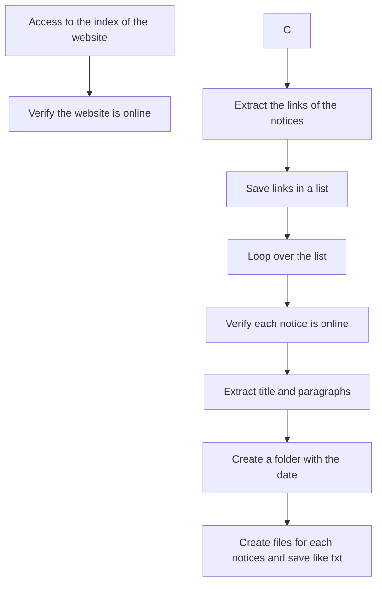

# Scrapper for La Gaceta Newspaper
La Gaceta is a newspaper very popular in the Cotopaxi province in the Ecuador Country.

Link to La Gaceta newspaper: https://lagaceta.com.ec/

----

**Table of Contents**

* **news.py** is the file that allows doing the scrapping in the website.

----

### Outcomes 

- A folder with the for each date that "news.py" is executed.

- The folder with the date has the news published and are currently public. 

- Each notice is saved like a .txt file with and the name is the title.
 
----

                
### FlowChart of the Scrapping
---

### Contacts:
---
- [Twitter](https://twitter.com/sarasti_seb)
- [LinkedIn](https://linkedin.com/in/sebastiansarasti)
- [ResearchGate](https://www.researchgate.net/profile/Sebastian-Sarasti-2)
